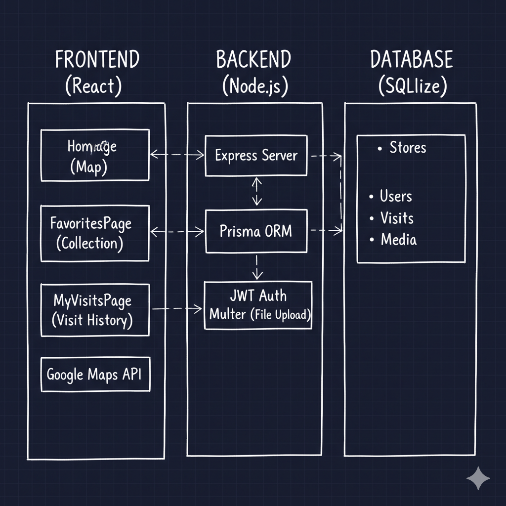

# 台灣選物店地圖 🗺️

選物店地圖 - 維基百科版，讓用戶可以在地圖上新增、編輯、瀏覽、收藏和記錄造訪過的選物店，共同建立選物店資料庫。

目前網站功能應該沒有大bug了，但還沒有什麼內容
(期中周生出這個難度陡升的作業，debug好幾天，沒時間搞真實店家和評論)

## 📋 專案簡介與功能清單

### 🎯 主題與使用情境
- **主題**：台灣選物店地圖與造訪記錄系統（維基百科版）
- **使用情境**：選物店愛好者可以在地圖上新增、編輯、瀏覽選物店資訊，收藏喜愛的店家，記錄造訪經驗並分享照片，共同建立選物店資料庫

### ✨ 主要功能
- 🗺️ **地圖瀏覽**：在 Google Maps 上顯示選物店位置
- ➕ **新增店家**：在地圖上新增選物店資訊
- ✏️ **編輯店家**：修改店家資訊、營業時間、照片等
- 🔍 **搜尋功能**：按店名、地址或標籤搜尋店家
- ❤️ **收藏功能**：收藏喜愛的店家
- 📝 **造訪記錄**：記錄造訪經驗、評分和照片
- 📸 **照片上傳**：為店家上傳照片
- 👤 **用戶系統**：註冊、登入、個人資料管理
- 🏷️ **標籤系統**：為店家添加分類標籤

## 🏗️ 架構圖

```
┌─────────────────┐    ┌─────────────────┐    ┌─────────────────┐
│   前端 (React)   │    │   後端 (Node.js) │    │   資料庫 (SQLite)│
│                 │    │                 │    │                 │
│ ┌─────────────┐  │    │ ┌─────────────┐  │    │ ┌─────────────┐  │
│ │  HomePage   │  │◄──►│ │  Express    │  │◄──►│ │   Stores    │  │
│ │  (地圖)     │  │    │ │  Server     │  │    │ │   Users     │  │
│ └─────────────┘  │    │ └─────────────┘  │    │ │   Visits    │  │
│                 │    │                 │    │ │   Media     │  │
│ ┌─────────────┐  │    │ ┌─────────────┐  │    │ └─────────────┘  │
│ │FavoritesPage│  │◄──►│ │   Prisma    │  │    │                 │
│ │  (收藏)     │  │    │ │   ORM       │  │    │                 │
│ └─────────────┘  │    │ └─────────────┘  │    │                 │
│                 │    │                 │    │                 │
│ ┌─────────────┐  │    │ ┌─────────────┐  │    │                 │
│ │MyVisitsPage │  │◄──►│ │   JWT       │  │    │                 │
│ │  (造訪記錄) │  │    │ │   Auth      │  │    │                 │
│ └─────────────┘  │    │ └─────────────┘  │    │                 │
│                 │    │                 │    │                 │
│ ┌─────────────┐  │    │ ┌─────────────┐  │    │                 │
│ │ Google Maps │  │◄──►│ │   Multer    │  │    │                 │
│ │    API      │  │    │ │  (檔案上傳) │  │    │                 │
│ └─────────────┘  │    │ └─────────────┘  │    │                 │
└─────────────────┘    └─────────────────┘    └─────────────────┘
```

## 🚀 前後端啟動步驟

### 環境需求
- Node.js 18+ 
- npm 或 yarn
- Google Maps API Key

### 1. 進入專案
```bash
cd hw4
```

### 2. 環境變數設定

**⚠️ 重要：請評分者務必替換為自己的 Google Maps API Key**

#### 前端環境變數 (.env)
```bash
# API 服務器 URL
VITE_API_BASE=http://localhost:3001

# Google Maps API Key (請替換為您的 Browser Key)
VITE_GOOGLE_MAPS_API_KEY=YOUR_BROWSER_KEY
```

#### 後端環境變數 (backend/.env)
```bash
# 服務器配置
PORT=3001
NODE_ENV=development

# 資料庫配置
DATABASE_URL="file:./dev.db"

# CORS 配置
FRONTEND_URL=http://localhost:5173

# JWT 配置
JWT_SECRET=your-super-secret-jwt-key-here-change-in-production
JWT_EXPIRES_IN=7d

# Cookie 配置
COOKIE_SECURE=false
COOKIE_SAME_SITE=lax

# 檔案上傳配置
UPLOAD_DIR=uploads
MAX_FILE_SIZE=5242880

# Google Maps Server Key (請替換為您的 Server Key)
GOOGLE_MAPS_SERVER_KEY=YOUR_SERVER_KEY
```


### 4. 啟動應用
```bash
# 啟動後端 (終端機 1)
cd backend
npm install
npm run dev

# 啟動前端 (終端機 2)
npm install
npm run dev
```

### 6. 訪問應用
- 前端：http://localhost:5173
- 後端 API：http://localhost:3001

### 種子資料說明
種子資料包含：
- **測試用戶**：`test@example.com` / `password123`
- **範例商店**：3 間選物店（台北、台南、高雄）
- **標籤**：文創、咖啡、手作、選物、設計
- **造訪記錄**：測試用戶的造訪記錄

資料庫初始化
```bash
cd backend
npx prisma generate
npx prisma db push
npm run db:seed  # 初始化種子資料
cd ..
```
## 🔑 Google Maps API 整合

### 整合的 Google Maps API 服務

本專案整合了以下 Google Maps API 服務：

#### 🌐 前端整合 (Browser Key)
1. **Maps JavaScript API**
   - 功能：顯示互動式地圖
   - 用途：主要地圖顯示、標記、資訊視窗
   - 檔案：`src/components/Map/GoogleMap.tsx`

2. **Places API - AutocompleteService**
   - 功能：地點自動完成搜尋
   - 用途：新增店家時的地點搜尋
   - 檔案：`src/components/StoreForm/PlaceSearchDialog.tsx`

3. **Places API - PlacesService**
   - 功能：獲取地點詳細資訊
   - 用途：取得地點的詳細資料（地址、電話、營業時間等）
   - 檔案：`src/components/StoreForm/PlaceSearchDialog.tsx`

#### 🖥️ 後端整合 (Server Key)
1. **Geocoding API**
   - 功能：地址與座標互相轉換
   - 用途：將地址轉換為經緯度座標
   - 檔案：`backend/src/routes/stores.ts`

2. **Places API - Place Details**
   - 功能：獲取地點詳細資訊
   - 用途：驗證地點資訊的準確性
   - 檔案：`backend/src/routes/stores.ts`

### API 使用場景

#### 🗺️ 地圖顯示
```javascript
// 初始化地圖
const map = new google.maps.Map(mapRef.current, {
  center: { lat: 23.9739, lng: 120.9820 },
  zoom: 8,
  mapTypeId: google.maps.MapTypeId.ROADMAP
});
```

#### 📍 地點搜尋
```javascript
// 使用 AutocompleteService 搜尋地點
const autocompleteService = new google.maps.places.AutocompleteService();
autocompleteService.getPlacePredictions({
  input: searchQuery,
  types: ['establishment']
}, (predictions, status) => {
  // 處理搜尋結果
});
```

#### 🏪 地點詳細資訊
```javascript
// 使用 PlacesService 獲取詳細資訊
const placesService = new google.maps.places.PlacesService(map);
placesService.getDetails({
  placeId: placeId,
  fields: ['name', 'formatted_address', 'geometry', 'opening_hours']
}, (place, status) => {
  // 處理地點詳細資訊
});
```

#### 🌍 地址轉換
```javascript
// 後端使用 Geocoding API
const geocoder = new google.maps.Geocoder();
geocoder.geocode({ address: address }, (results, status) => {
  if (status === 'OK' && results[0]) {
    const location = results[0].geometry.location;
    // 獲取經緯度座標
  }
});
```

### API Key 設定

#### 必要服務啟用
請確保您的 Google Maps API Key 啟用了以下服務：
- **Maps JavaScript API** - 地圖顯示
- **Geocoding API** - 地址轉換為座標
- **Places API** - 地點搜尋和詳細資訊

#### API Key 類型
- **Browser Key** (前端用)：用於 VITE_GOOGLE_MAPS_API_KEY
- **Server Key** (後端用)：用於 GOOGLE_MAPS_SERVER_KEY

### Google API 使用量控制

#### 🚦 節流機制
- **請求頻率限制**：同一 API 請求間隔至少 1 秒
- **快取機制**：API 結果快取 5 分鐘，避免重複請求
- **工具類別**：`src/utils/googleMapsThrottle.ts`

#### 📊 使用量監控
- 定期檢查 Google Cloud Console 中的 API 使用量
- 設定配額警報，避免超出限制
- 使用快取減少不必要的 API 呼叫

#### 🔧 節流實作範例
```javascript
import GoogleMapsThrottle from '../utils/googleMapsThrottle'

const throttle = GoogleMapsThrottle.getInstance()

// 節流請求
const result = await throttle.throttleRequest(
  'places-search',
  () => autocompleteService.getPlacePredictions(options),
  1000 // 1秒間隔
)

// 快取請求
const cachedResult = await throttle.cachedRequest(
  'place-details-' + placeId,
  () => placesService.getDetails(options),
  300000 // 5分鐘快取
)
```

### 安全注意事項

⚠️ **重要提醒**：
- 前端 API Key 會暴露在瀏覽器中，請設定適當的 HTTP 引用者限制
- 後端 API Key 請設定 IP 限制以提高安全性
- 定期監控 API 使用量，避免超出配額

## 📚 後端 API 一覽

### 認證相關
- `POST /api/auth/register` - 用戶註冊
- `POST /api/auth/login` - 用戶登入
- `POST /api/auth/logout` - 用戶登出
- `GET /api/auth/me` - 獲取當前用戶資訊

### 商店相關
- `GET /api/stores` - 獲取商店列表
- `GET /api/stores/:id` - 獲取商店詳情
- `POST /api/stores` - 創建新商店
- `PUT /api/stores/:id` - 更新商店資訊
- `POST /api/stores/:id/photos` - 為商店添加照片

### 收藏相關
- `GET /api/favorites` - 獲取用戶收藏列表
- `POST /api/favorites/:storeId` - 收藏商店
- `DELETE /api/favorites/:storeId` - 取消收藏

### 造訪記錄相關
- `GET /api/visits` - 獲取用戶造訪記錄
- `POST /api/visits` - 創建造訪記錄
- `PUT /api/visits/:id` - 更新造訪記錄
- `DELETE /api/visits/:id` - 刪除造訪記錄

### 媒體相關
- `POST /api/media/upload` - 上傳媒體檔案
- `GET /api/media/:id` - 獲取媒體檔案
- `GET /api/media/:id/info` - 獲取媒體資訊
- `DELETE /api/media/:id` - 刪除媒體檔案

## 🌐 cURL 範例

### 1. 用戶註冊
```bash
curl -X POST http://localhost:3001/api/auth/register \
  -H "Content-Type: application/json" \
  -d '{
    "username": "testuser",
    "email": "test@example.com",
    "password": "password123"
  }'
```

### 2. 用戶登入
```bash
curl -X POST http://localhost:3001/api/auth/login \
  -H "Content-Type: application/json" \
  -d '{
    "email": "test@example.com",
    "password": "password123"
  }' \
  -c cookies.txt
```

### 3. 獲取商店列表（需要認證）
```bash
curl -X GET http://localhost:3001/api/stores \
  -H "Content-Type: application/json" \
  -b cookies.txt
```

### 4. 創建新商店（需要認證）
```bash
curl -X POST http://localhost:3001/api/stores \
  -H "Content-Type: application/json" \
  -b cookies.txt \
  -d '{
    "name": "測試選物店",
    "lat": 25.0330,
    "lng": 121.5654,
    "address": "台北市信義區信義路五段7號",
    "openingHours": "週一至週日 10:00-22:00",
    "tagNames": ["文創", "設計"]
  }'
```

### 5. 收藏商店（需要認證）
```bash
curl -X POST http://localhost:3001/api/favorites/store-id-here \
  -H "Content-Type: application/json" \
  -b cookies.txt
```

### 6. 創建造訪記錄（需要認證）
```bash
curl -X POST http://localhost:3001/api/visits \
  -H "Content-Type: application/json" \
  -b cookies.txt \
  -d '{
    "storeId": "store-id-here",
    "rating": 5,
    "note": "很棒的選物店，商品很有特色！",
    "photoIds": ["photo-id-1", "photo-id-2"]
  }'
```

## ⚠️ 安全性風險說明

### Google Maps API Key 安全風險
**重要警告**：本專案使用 Google Maps API Key 無 IP 限制設定，存在以下安全風險：

1. **API Key 洩露風險**
   - 前端 API Key 可能被惡意用戶提取
   - 可能被用於超出配額的請求
   - 可能產生額外的費用

2. **建議的安全措施**
   - 在生產環境中設定 IP 限制
   - 使用 Google Cloud Console 監控 API 使用量
   - 定期輪換 API Key
   - 設定適當的配額限制

3. **開發環境注意事項**
   - 請勿在版本控制中提交真實的 API Key
   - 使用 `.env.example` 作為範本
   - 定期檢查 API 使用量


**⚠️ 評分者注意**：請務必將 `.env` 檔案中的 `YOUR_BROWSER_KEY` 和 `YOUR_SERVER_KEY` 替換為您自己的 Google Maps API Key，否則地圖功能將無法正常運作。